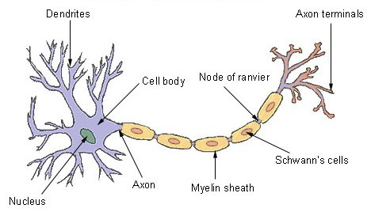

# Artificial Neural Network 
This repository contain implementation of Artificial Neural Network Algorithm in several programming languanges and frameworks. This repository was created to introduce artifical neural network in a simple way. Artificial Neural Network has become popular at this time. This branch field of Artificial Intelligence has given powerful impact to our daily life such as social media recomendation system, face detection of camera on phone and many more. Therefore, to keep up our knowledge in technology especially Artificial Intelligence, we have to understand the concept of Artificial Neural Network.

>"AI is the new electricity" 
> 
>                -Andrew Ng

### Table of Contents
   - [What is ANN?](#what)
   - [How ANN Works?](#how)

<a name="what"/>
## What is ANN?
Artificial Neural Network or simply ANN is one of bio-inspired algorithm that mimicking the work of neural network in brain. Neural network in brain consist of many neuron that will receive and fire electric signal each other. Generally speaking, these neurons have dendrites, cell body, axon, and axon terminals. These neuron receive electrical signal via dendrites then go pass through body cell also called soma which contain nucleus. After the electrical signal pass through the soma, axon will transmit it to axon terminals and the electrical signal will jump over synapses to another neuron. This notion of how neuron work had inspired Warren S. McCulloch and Walter H. Pitts to wrote a paper which titled [A Logical Calculus of The Ideas Immanent in Nervous Activity](http://www.cse.chalmers.se/~coquand/AUTOMATA/mcp.pdf). This paper explained about the early mathematical concept of ANN called artificial neuron or threshold logic unit. This concept develop progressively, from artificial neuron to perceptron then multi layer perceptron. The concept of multi layer perceptron or MLP will lead us to Deep Learning.

<a name="how"/>
## How ANN Works?
So, how does ANN work?
